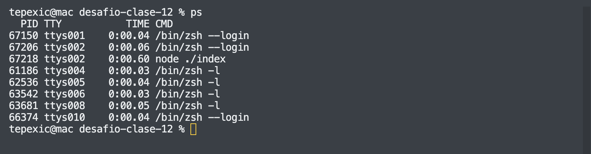
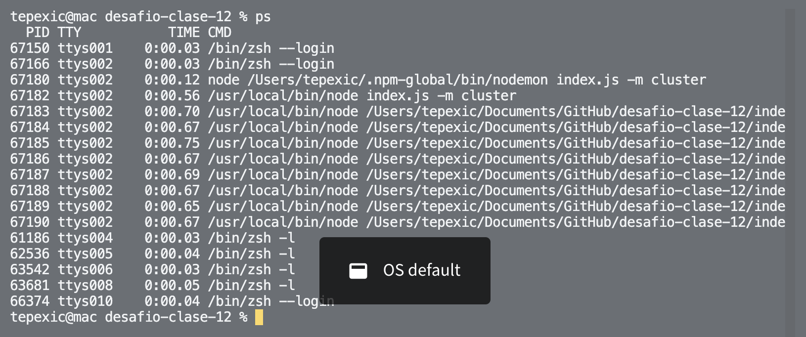
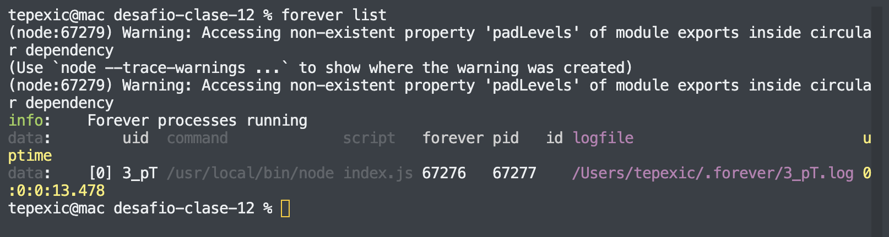
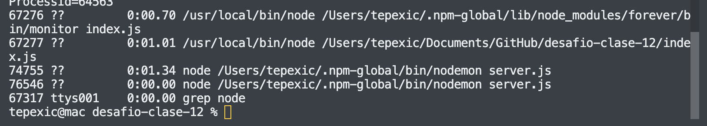
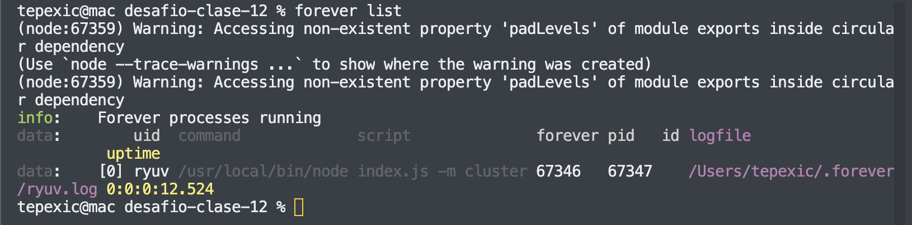
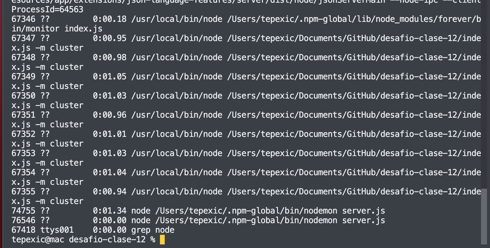
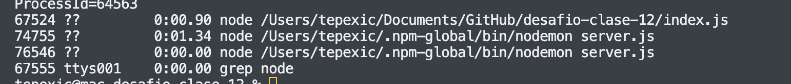
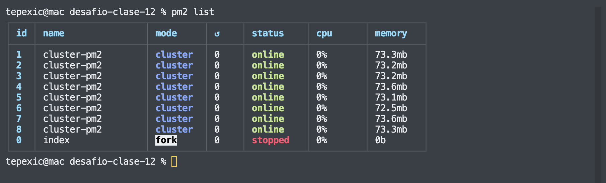
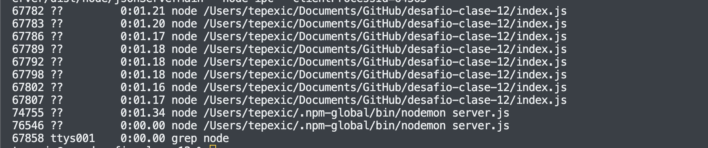

# Desafío Clase 30

## Consigna: Modo cluster y servidor

Tomando con base el proyecto que vamos realizando, agregar un parámetro más en la ruta de comando que permita ejecutar al servidor en modo fork o cluster. Dicho parámetro será 'FORK' en el primer caso y 'CLUSTER' en el segundo, y de no pasarlo, el servidor iniciará en modo fork.

- Agregar en la vista info (`http://localhost:8080/info/`), el número de procesadores presentes en el servidor.
- Ejecutar el servidor (modos FORK y CLUSTER) con nodemon verificando el número de procesos tomados por node.
- Ejecutar el servidor (con los parámetros adecuados) utilizando Forever, verificando su correcta operación. Listar los procesos por Forever y por sistema operativo.

### Resolucion

Instalar dependencias

```
npm install
```

EL servidor se ejecuta desde el archivo `./inmdex.js`. Se puede cambiar el puerto mediante el argumento `-p` y el modo (cluster o fork) mediante el argumento `-m`. Por defecto, el puerto es 8080 y el modo, fork. Ejemplos:

### Con node:

```
node index.js
node index.js -p 8082
node index -p 8082 -m cluster
```

Procesos modo fork:



Procesos modo cluster:


### Con nodemon (no incluido en el package.json):

```
nodemon index.js
nodemon index.js -p 8082
nodemon index -p 8082 -m cluster
```

Procesos modo fork:



Procesos modo cluster:


### Con forever (no incluido en el package.json):

```
forever start -w index.js
forever start -w index.js -p 8082
forever start -w index.js -m cluster
```

Para detener: `forever stop index.js`

Procesos con modo fork:




Procesos con modo cluster:




### Con PM2 (no incluido en el package.json):

```
pm2 start index.js -w
pm2 start index.js --name="cluster-pm2"  -w -i max
```

Procesos con modo fork:




Procesos con modo cluster:



