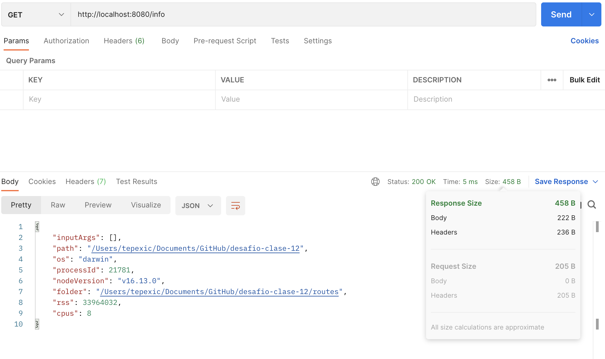
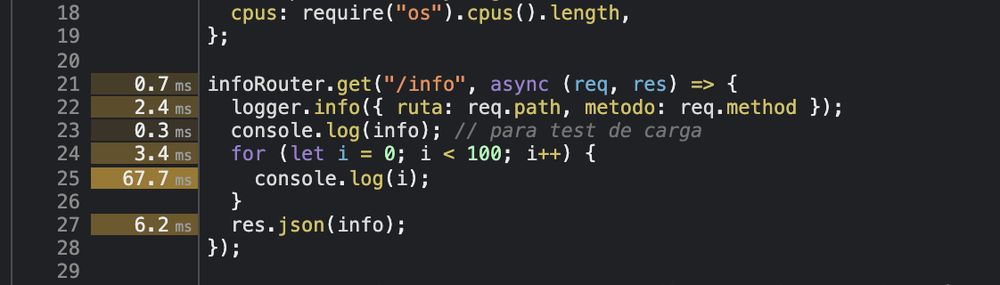

# Desafío LOGGERS, GZIP y ANÁLISIS DE PERFORMANCE

## Para correr el proyecto

```
npm install
node index.js
```

**Se supone instalación global de artillery y 0x **

## GZIP

Incorporar al proyecto de servidor de trabajo la compresión gzip. Verificar sobre la ruta `/info` con y sin compresión, la diferencia de cantidad de bytes devueltos en un caso y otro:

### Resolución:

- Desarrrollé la consiga en un nueva ruta `/infozip`, adicional a `/info`
- Como se aprecia en las imagenes, debido a la poca informacion que contiene el cuerpo de la transferencia, no existe compresión. La ruta `/infozip` resulta más pesada porque contiene un encabezado extra.
  
  

## LOGGERS

Luego implementar loggueo (con alguna librería vista en clase) que registre lo siguiente:

- Ruta y método de todas las peticiones recibidas por el servidor (info)
- Ruta y método de las peticiones a rutas inexistentes en el servidor (warning)
- Errores lanzados por las apis de mensajes y productos, únicamente (error)

Considerar el siguiente criterio:

- Loggear todos los niveles a consola (info, warning y error)
- Registrar sólo los logs de warning a un archivo llamada warn.log
- Enviar sólo los logs de error a un archivo llamada error.log

### Resolución:

- Agregué el archivo `/utils/logs.js` que crea un logger con Winston
- Cada ruta contiene la linea `logger.info({ruta: req.path, metodo: req.method});` para loggear por consola la ruta y método asociados.
- El router de productos, y los sockets de mensajes y productos, loggean errores al archivo `/logs/error.log`
- Las rutas inexistentes se loggean en `logs/warn.log`

## ANÁLISIS COMPLETO DE PERFORMANCE

Luego, realizar el análisis completo de performance del servidor con el que venimos trabajando.
Vamos a trabajar sobre la ruta '/info', en modo fork, agregando ó extrayendo un console.log de la información colectada antes de devolverla al cliente. Además desactivaremos el child_process de la ruta '/randoms'
Para ambas condiciones (con o sin console.log) en la ruta '/info' OBTENER:

1. El perfilamiento del servidor, realizando el test con --prof de node.js. Analizar los resultados obtenidos luego de procesarlos con --prof-process.

   Utilizaremos como test de carga Artillery en línea de comandos, emulando 50 conexiones concurrentes con 20 request por cada una. Extraer un reporte con los resultados en archivo de texto.

### Resolución:

- Perfilamiento _SIN_ `console.log()`: Corrí `artillery quick --count 50 -n 20 "http://localhost:8080/info" > profiling/sinConsoleLog.txt` con la instalacion global de artillery. Los resultados fueron:
  | ticks | total | nonlib | name |
  | ----- | ----- | ------ | ---- |
  | 47 | 2.8% | 3.0% | JavaScript |
  | 1491 | 87.6% | 96.1% | C++ |
  | 185 | 10.9% | 11.9% | GC |
  | 151 | 8.9% | | Shared libraries |
  | 14 | 0.8% | | Unaccounted |

  El reporte completo está en [result-sin.txt](/result-sin.txt)

- Perfilamiento _CON_ `console.log()`: Corrí `artillery quick --count 50 -n 20 "http://localhost:8080/info" > profiling/conConsoleLog.txt` con la instalacion global de artillery. Los resultados fueron:
  |ticks | total | nonlib | name |
  | ---- | ------ | ------- | ----- |
  | 87 | 3.6% | 3.7% | JavaScript |
  | 2239 | 92.1% | 95.7% | C++ |
  | 229 | 9.4% | 9.8% | GC |
  | 92 | 3.8% | | Shared libraries |
  | 14 | 0.6% | | Unaccounted |

  El reporte completo está en [result-con.txt](/result-con.txt)

## Con Autocannon

Luego utilizaremos Autocannon en línea de comandos, emulando 100 conexiones concurrentes realizadas en un tiempo de 20 segundos. Extraer un reporte con los resultados (puede ser un print screen de la consola)

### Resolución

Para este ejercicio, agregué dos comandos al `package.json`, el primero es `start-profile`, que corre el `index.js` con `0x`. El segundo es `test`, que ejecuta el archivo `autocannon-test/test.js`.

Mediante estos comandos, se obtiene el siguiente resultado:

- Sin `console.log()`:

  ```
  > desafio-clase-12@1.0.0 test
  > node ./autocannon-test/test.js

  Running test...
  Running 20s test @ http://localhost:8080/info
  100 connections

  ┌─────────┬───────┬───────┬───────┬────────┬──────────┬───────────┬─────────┐
  │ Stat    │ 2.5%  │ 50%   │ 97.5% │ 99%    │ Avg      │ Stdev     │ Max     │
  ├─────────┼───────┼───────┼───────┼────────┼──────────┼───────────┼─────────┤
  │ Latency │ 10 ms │ 23 ms │ 74 ms │ 470 ms │ 40.66 ms │ 215.18 ms │ 6853 ms │
  └─────────┴───────┴───────┴───────┴────────┴──────────┴───────────┴─────────┘
  ┌───────────┬─────┬──────┬───────┬─────────┬────────┬─────────┬───────┐
  │ Stat      │ 1%  │ 2.5% │ 50%   │ 97.5%   │ Avg    │ Stdev   │ Min   │
  ├───────────┼─────┼──────┼───────┼─────────┼────────┼─────────┼───────┤
  │ Req/Sec   │ 0   │ 0    │ 1     │ 3817    │ 814.7  │ 1234.75 │ 1     │
  ├───────────┼─────┼──────┼───────┼─────────┼────────┼─────────┼───────┤
  │ Bytes/Sec │ 0 B │ 0 B  │ 457 B │ 1.74 MB │ 372 kB │ 564 kB  │ 457 B │
  └───────────┴─────┴──────┴───────┴─────────┴────────┴─────────┴───────┘

  Req/Bytes counts sampled once per second.

  16k requests in 20.08s, 7.45 MB read
  88 errors (88 timeouts)
  ```

- Con `console.log()`:

  ```
  > desafio-clase-12@1.0.0 test
  > node ./autocannon-test/test.js
  Running test...
  Running 20s test @ http://localhost:8080/info
  100 connections

  ┌─────────┬───────┬───────┬────────┬────────┬──────────┬───────────┬─────────┐
  │ Stat    │ 2.5%  │ 50%   │ 97.5%  │ 99%    │ Avg      │ Stdev     │ Max     │
  ├─────────┼───────┼───────┼────────┼────────┼──────────┼───────────┼─────────┤
  │ Latency │ 18 ms │ 24 ms │ 128 ms │ 443 ms │ 41.52 ms │ 231.77 ms │ 6947 ms │
  └─────────┴───────┴───────┴────────┴────────┴──────────┴───────────┴─────────┘
  ┌───────────┬─────┬──────┬───────┬─────────┬────────┬─────────┬───────┐
  │ Stat      │ 1%  │ 2.5% │ 50%   │ 97.5%   │ Avg    │ Stdev   │ Min   │
  ├───────────┼─────┼──────┼───────┼─────────┼────────┼─────────┼───────┤
  │ Req/Sec   │ 0   │ 0    │ 1     │ 3335    │ 816.1  │ 1232.87 │ 1     │
  ├───────────┼─────┼──────┼───────┼─────────┼────────┼─────────┼───────┤
  │ Bytes/Sec │ 0 B │ 0 B  │ 457 B │ 1.52 MB │ 373 kB │ 563 kB  │ 457 B │
  └───────────┴─────┴──────┴───────┴─────────┴────────┴─────────┴───────┘

  Req/Bytes counts sampled once per second.

  17k requests in 20.09s, 7.46 MB read
  87 errors (87 timeouts)
  ```

## Con --inspect

2. El perfilamiento del servidor con el modo inspector de node.js --inspect. Revisar el tiempo de los procesos menos performantes sobre el archivo fuente de inspección.

### Resolución

Al correr el servidor con `node --inspect` y volver a ejecutar el comando de artillery para las pruebas de carga (sin guardar el resultado, puesto que se hizo en un ejercicio anterior) se obtiene:

- Sin `console.log()`:
  El proceso que más tiempo consume es el garbage collector de Node:
  ")
- Con `console.log()`:
  El proceso que más tiempo consume es la impresion a la consola:
  ")
  El codigo responsable del retraso es facilmente detectable en esta vista:
  

3. El diagrama de flama con 0x, emulando la carga con Autocannon con los mismos parámetros anteriores.

- Sin `console.log()`
  ")
  El reporte completo está en [0x-sin-console-log/flamegraph.html](0x-sin-console-log/flamegraph.html)

- Con `console.log()`
  ")
  El reporte completo está en [0x-con-console-log/flamegraph.html](0x-con-console-log/flamegraph.html)

## Conclusión

- Existe una gran variedad de perfiladores y herramientas de análisis de rendimiento que pueden ayudar a debuggear el código e identificar cuellos de botella. Su uso puede servir para tener una aplicación con mejor desempeño. Este desempeño se traduce en mayor rapidez en la transferencia y procesamiento de datos, así como ventajas monetarias al utilizar menos recursos del servidor. En el caso de los servicios en la nube que se cobran por milisegundos, el poder identificar y posiblemente corregir los retrasos en la aplicación, puede ahorrarnos mucho dinero.

- Creo que las herramientas no son sustituto una de la otra, sino que se complementan. Hay casos en los que un elemento gráfico puede ayudar más que una tabla con un resumen estadístico.

- El servidor mostró un desempeño mucho mejor sin la función síncrona. Lo podemos ver en cualquiera de los perfiladores que se usaron. Por ejemplo, con `--prof`, el código síncrono usa casi el doble de _ticks_ que el que no inlcuye la impresión a consola. Con `0x`, esta diferencia se ve en el promedio de duración de las llamadas a la ruta, siendo la implementación con `console.log()` 1.4ms más lenta, en promedio. En este caso en particular, no se aprecia una diferencia evidente en el diagrama de flama.
